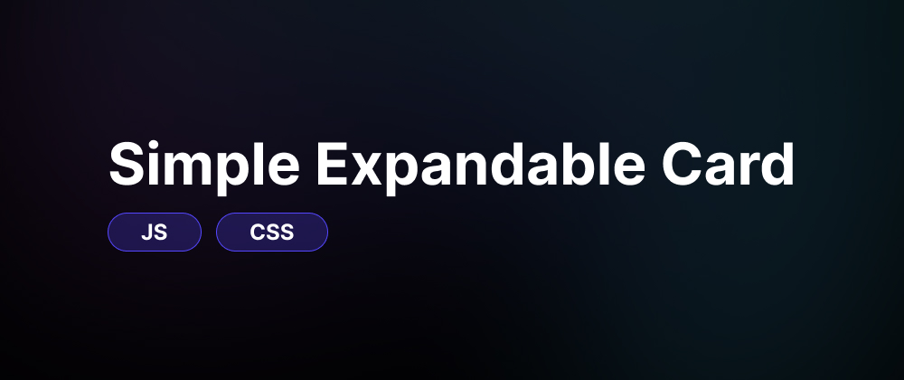
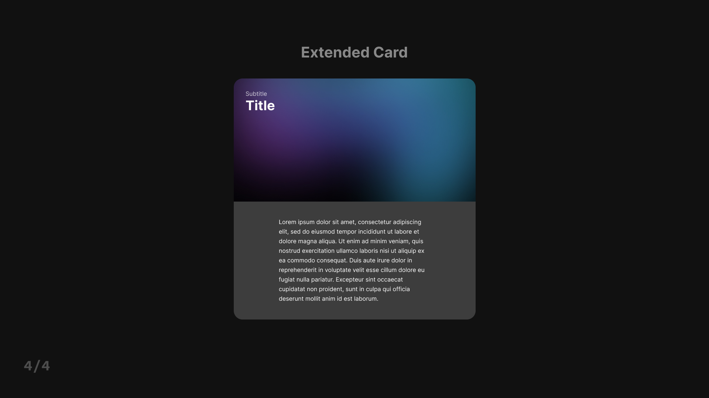

# Simple Expandable Card

## Expandable cards on the Web?

You have most likely used the Apple app store, and been fascinated by the smooth card transitions to a full-screen page. It’s a common transition on native mobile apps, but it’s quite rare on the web. But fear not, we are going to create a boot lag version of it on the web, and for the cherry on top, we won’t use any additional library.

## Just a couple of things before we begun

As you most likely will find out, there is much room for improvement. For example you might want to wrap the expanded card inside a dialog element to trap the focus and help with the accessibility or do a shallow path change on expand and shrink. In case you need a production-ready method for animating between two states you can use libraries such as framer-motion, or wait for the `Web Transitions API` to become available on Safari.

## How to do it?

It's quite simple, there are 4 main steps in the process of expanding a card.


### Step 0 - Create your 2 cards

The two cards should have the same portion for the transition between them, you can see an example of it in image-1.


### Step 1 - Scaling down the expanded card to the same width

In this step we need to scale down the extended card to the same width as the original card, we can use the `transform: scale(x);` for this action.


### Step 2 - Masking to hide the extended portion

We have to use a clip-path to hide the extended portion of the expanded card. We can use the `clip-mask: inset(0 0 x% 0);` to mask the expanded card from the bottom up.


### Step 3 - Positioning the cards

Since we want to expand the card from the original card, we have to position it at the same point. We can get the position of the original card with `el.getBoundingClientRect()` function, then use the `transform: translate(top, left);` with the addition of `position: fixed;` to place the expanded card at the same position of the original card.



### Step 4 - Animating

Now the only thing between us and the buttery smooth animation is the addition of `transition` property in the CSS.

## Let's code it

### Starting point

Since in this guide, we are trying to focus on the animation mechanism, here are the base HTML and css files.

#### `index.html`

```html
<!DOCTYPE html>
<html dir="ltr" lang="en">
  <head>
    <meta charset="UTF-8" />
    <link rel="icon" type="image/svg+xml" href="/vite.svg" />
    <meta name="viewport" content="width=device-width, initial-scale=1.0" />
    <link href="style.css" rel="stylesheet" />
    <title>Expandable Card</title>
  </head>
  <body>
    <button data-state="visible" class="card" id="card">
      
      <div class="header">
        <h3>Subtitle</h3>
        <h2>Title</h2>
      </div>
    </button>
    <div data-state="hidden" class="card" id="expandableCard">
      
      <div class="header">
        <h3>Subtitle</h3>
        <h2>Title</h2>
      </div>
      <button id="close">Close</button>
      <div class="content">
        Lorem ipsum, dolor sit amet consectetur adipisicing elit. Repellendus,
        dolor! Error nostrum quos illum aperiam! Mollitia praesentium excepturi
        dolorum, odio perferendis consectetur earum possimus quis in eum ab
        consequuntur explicabo.
      </div>
    </div>
    <script type="module" src="/main.js"></script>
  </body>
</html>
```

#### `style.css`

```CSS
 {
  padding: 0;
  margin: 0;
  box-sizing: border-box;
}

body {
  font-family: -apple-system, BlinkMacSystemFont, 'Segoe UI', Roboto, Oxygen,
    Ubuntu, Cantarell, 'Open Sans', 'Helvetica Neue', sans-serif;
  background: #111;
  color: #eee;
  display: flex;
  justify-content: center;
  align-content: center;
  align-items: center;
  flex-direction: column;
  height: 100vh;
}

.card .header h2 {
  font-size: 2rem;
}

.card .header h3 {
  font-size: 1rem;
  font-weight: 300;
  opacity: 0.75;
}

button {
  display: flex;
  border: none;
  background: transparent;
  color: inherit;
  font-size: inherit;
  text-align: inherit;
}

button:hover {
  cursor: pointer;
}

.card {
  --padding-amount: 1.4rem;
  --border-radius: 1.5rem;
  width: min(400px, 80vw);
  position: relative;
  clip-path: inset(0 0 0 0 round var(--border-radius));
  background: #333;
  transform-origin: top left;
  overflow: auto;
}

.card .img {
  width: 100%;
  aspect-ratio: 16 / 9;
}

.card .header {
  position: absolute;
  top: 0;
  left: 0;
  transform-origin: top left;
  transform: translate(var(--padding-amount), var(--padding-amount));
}

.card .content {
  padding: 2rem;
}

.card #close {
  position: absolute;
  top: 0;
  right: 0;
  background: #111;
  border-radius: var(--border-radius);
  padding: 0.4rem 1.6rem;
  z-index: 10;
  opacity: 0;
  transition: opacity 0.15s ease-in-out;
  transform: translate(calc(var(--padding-amount) * -1), var(--padding-amount));
}

.card#expandableCard {
  width: 100%;
  height: 100vh;
}
```

#### Some explanations

There are a couple of shortcomings and limitations to my method. We need to use the `round` value inside the `clip-path` to add the border radius. Due to the `clip-path` we can’t add `box-shadow`.

### Sending data to css

Since we need to know the width, height, and positioning of the main card, we need to pass the data to css. We can achieve it by using css variables. Additionally, we have to pass down the current state of the cards. For this purpose the HTML attribute tags are wonderful.

#### Getting the elements

```js
// main.js
const ogCard = document.getElementById('card');
const exCard = document.getElementById('expandableCard');
const close = document.getElementById('close');
```

#### UpdatePos function

```js
// main.js
/**
 * Generates required data for animation
 */
const updatePos = () => {
  const { top, left, width, height } = ogCard.getBoundingClientRect();

  const screenWidth = window.innerWidth;
  const screenHeight = window.innerHeight;

  // Data required to position the element
  exCard.style.setProperty('--top', `${top}px`);
  exCard.style.setProperty('--left', `${left}px`);

  // Data required to scale the element
  exCard.style.setProperty('--screen-width', `${screenWidth}`);
  exCard.style.setProperty('--screen-height', `${screenHeight}`);
  exCard.style.setProperty('--width', `${width}`);
  exCard.style.setProperty('--height', `${height}`);
};
```

#### Adding event listeners and toggling states

```js
// main.js
/**
 * onExpand adds the required data to extendableCard.
 */
const onExpand = () => {
  updatePos();

  // Since we have to wait for the variables to be applied,
  // the states have to be updated on a next page render.
  // For this purpose  we add a timeout with 1ms timeout time.
  setTimeout(() => {
    // Setting data attributes on card elements
    exCard.setAttribute('data-state', 'expanded');
    ogCard.setAttribute('data-state', 'hidden');
  }, 1);
};

ogCard.addEventListener('click', onExpand);

/**
 * onShrinks shrinks down the card and hide it.
 */
const onShrink = () => {
  updatePos();

  exCard.setAttribute('data-state', 'shrink');

  setTimeout(() => {
    // Setting data attributes on card elements
    exCard.setAttribute('data-state', 'hidden');
    ogCard.setAttribute('data-state', 'visible');
  }, 300 + 1);
};

close.addEventListener('click', onShrink);
```

### Setting Up the Animation

#### Scaling down the expanded card to the same width

```css
/* index.css */
.card#expandableCard {
  --width-scale: calc(var(--screen-width) / var(--width));
  transform: scale(calc(1 / var(--width-scale)));
  clip-path: inset(
    0 0 0 0 round calc(var(--border-radius) * var(--width-scale))
  );
}

.card#expandableCard .header {
  transform: translate(
      calc(var(--padding-amount) * var(--width-scale)),
      calc(var(--padding-amount) * var(--width-scale))
    ) scale(var(--width-scale));
}
```

Here are some additional explanations, since we are scaling everything down, the border radiuses and the inside elements will also get scaled-down, therefore we need to add some changes to make them look the same as the main card. Firstly we have to multiply the `clip-path` border radius by the scaling factor, additionally, we need to multiply the distance and increase the scale of the header group by the same scaling value.

#### Positioning the expanded card

```css
/* style.css */
.card#expandableCard {
  --width-scale: calc(var(--screen-width) / var(--width));
  top: 0;
  top: 0;
  position: fixed;
  opacity: 0.5;
  transform: translate(var(--left), var(--top)) scale(
      calc(1 / var(--width-scale))
    );
}
```

We have to position the expanded card in the same place as the original card, which is quite easy to do. Keep in mind the reason for re-writing the `scale(calc( 1 - var(--width-scale) )` portion is due to the fact we are replacing the previous transform.

#### Masking the extended portion

```css
/* style.css */
.card#expandableCard {
  --bottom-clip: calc(
    calc(var(--screen-height) - var(--height) * var(--width-scale)) / var(
        --screen-height
      ) * 100%
  );
  clip-path: inset(
    0 0 var(--bottom-clip) 0 round calc(
        var(--border-radius) * var(--width-scale)
      )
  );
}
```

Since the expanded card is taller than the original card, we have to mask some parts of it. For this, we have to use the following form.

$(expandedHeight - ( originalHeight * scale ))(\frac{100}{ expandedHeight})$

The result will be the amount that we need to mask in percentage.

#### Setting up the transitions

##### Hiding the expandable card

```css
/* style.css */
.card#expandableCard {
  opacity: 0;
}
```

##### Hiding the original card while the expanded card is displayed

```css
/* style.css */
.card#expandableCard[data-state='hidden'] {
  pointer-events: none;
}
```

##### Adding transition to the expandable card while it isn’t hidden

```css
/* style.css */
.card#expandableCard:not([data-state='hidden']) {
  transition: transform 0.3s ease-in-out, clip-path 0.3s ease-in-out;
}
.card#expandableCard:not([data-state='hidden']) .header {
  transition: transform 0.3s ease-in-out;
}
```

##### Resetting the shrunk values to default

```css
/* style.css */
.card#expandableCard[data-state='expanded'] {
  opacity: 1;
  clip-path: inset(0 0 0 0 round 0);
  transform: translate(0, 0);
}
.card#expandableCard[data-state='expanded'] .header {
  transform: translate(var(--padding-amount), var(--padding-amount)) scale(1);
}
```

##### Displaying the close button while the card is fully expanded

```css
/* style.css */
.card#expandableCard[data-state='expanded'] #close {
  opacity: 1;
}
```

## The complete example

You can find the complete example on the current github repository or the following codesandbox link.

[](https://codesandbox.io/s/expandable-card-c4t38q?fontsize=14&hidenavigation=1&theme=dark)
